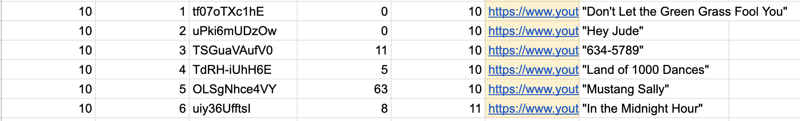

# audio-tossup-generator

Audio Tossup Generator creates .mp3 files from YouTube link information organized in a spreadsheet. 

## Installation
### Mac
- Clone the repo. The easiest way to do this is to hit the green dropdown titled Code' and copy the HTTPS link.
- - Open a Terminal session, and run `git clone` then paste the HTTPS link.
- If you do not have homebrew, [install homebrew](https://brew.sh/).
-   - Install the ffmpeg library with `brew install ffmpeg`. If you previously have a brew install, you may have to run `brew update` or uninstall and reinstall for this step to be successful.
- In Terminal, run `python --version  ` . If a version of Python 2 is listed, run `python3 --version`.
- - Open `generate.py` in the repository. If there is a mismatch between the Python version of line 1 in the script, change line 1 to correspond to the version on your machine.
- - Install pytube with `python3 -m pip install --upgrade pytube`. Whether you run `python` or `python3` depends on the result of the previous step.
- - - `pytube` is a library that frequently breaks. You may have to run this previous command throughout your usage of this repo if you are getting pytube errors in the console.

#### Debugging
- Monitor your Terminal console for errors when using this repo. If an error is related to a library like pytube or ffmpeg, there likely has been a discussion created for it and solution available in Stack Overflow, which you can find by googling.

## Usage
- Any software that can output a .csv file can be used to write the information in an audio tossup. Here is a sample audio tossup on Wilson Pickett.

- <strong>Column A:</strong> Tossup number. This value should be unique to a question in a sheet.
- <strong>Column B:</strong> Clue number. If your tossup is to have 6 clues, numbering the clues 1-6 like in the image is fine. You may change 6 to 5, 7 or any number of clues.
- <strong>Column C:</strong> Youtube video ID. The ID is listed after `watch?v=` in a typical Youtube Video's URL.
- <strong>Column D:</strong> Starting timestamp for the audio clip you want to use from the video, in total seconds. For example, if the clip you want to use starts at 4:31, the value you would put is 271.
- <strong>Column E:</strong> Duration of clip. Typically this lasts somewhere between 5 or 15 seconds.
- <strong>Column F:</strong> Youtube Link. Highly recommended that you use a formula to calculate this based on columns C through E.
- <strong>Column G:</strong> Song title. Not required, as it is not read by the script, but is useful for remembering the names of the clips.

### Editing the script
- If you would like to generate a series of tossups in a loop, uncomment line 12 of the script and comment line 13.
- The numbers on line 12 or 13, depending on which one is being used, correspond to the Tossup number(s) in the sheet being generated

## Additional Notes
